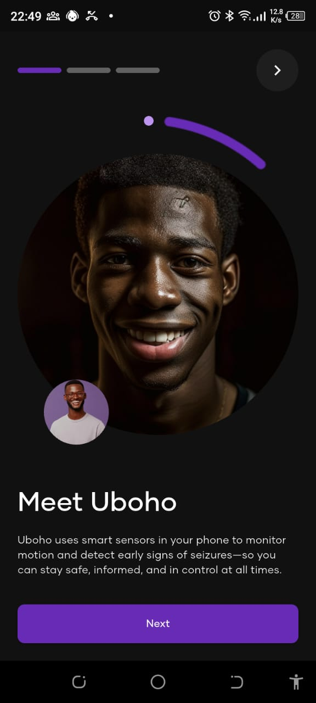

# Uboho App




**Uboho** is a real-time mobile monitoring application designed for individuals living with epilepsy. It passively captures motion and rotation data using smartphone sensors, applies AI-based seizure detection models, and connects patients to healthcare providers through real-time alerts, communication, and remote monitoring.

---

## Relevant Links
- [Final Demo_video](https://drive.google.com/file/d/1XLzOHM6Bv0CMiRLJ8UZinhGnnOnriDTX/view?usp=drive_link)
- [APK file](https://drive.google.com/file/d/1P6c8OTIzJb-7oPbrxBC6F3g80XjQEwq8/view?usp=drive_link)
- [figma design](https://www.figma.com/design/EjFiGZ5k5acmHJRQBd7kbL/Uboho?node-id=0-1&t=KELwLbz414nI3asK-1)
- [Model Notebook](https://colab.research.google.com/drive/1A0p8y6ESvFTNLna3j7ZdFADVQKIYOiaY?usp=sharing)
- [Link to repo](https://github.com/Isaiah-Essien/uboho_mobile)
- [Link to result Analysis](https://docs.google.com/document/d/1VcpaDektwOJMmtjM2LOTRAUTh_5AqvCrXtK0OyX-ykY/edit?usp=sharing)
- [Link to the Web dashabord's repo](https://github.com/Isaiah-Essien/uboho_web_dashboard)
- [Link to Deployed web Dashboard](https://quiet-elf-a156b4.netlify.app)

---
## What Uboho Does

Uboho is a mobile companion that combines artificial intelligence and continuous monitoring to detect possible epileptic seizures and provide timely intervention.

- Real-time motion and rotation tracking using accelerometer and gyroscope sensors
- Live chart visualization of motion intensity and rotation activity
- On-device seizure detection powered by a machine learning model
- Emergency alert system with GPS location sharing
- Secure chat interface for patient-doctor communication
- Automatic email onboarding for new patients and doctors
- Cloud integration with a hospital dashboard for continuous monitoring

---

## Key Features

| Feature                    | Description |
|----------------------------|-------------|
| Motion & Rotation Graphs   | Displays real-time motion and rotation charts based on sensor data |
| AI Seizure Detection       | Lightweight ML model runs on the device to detect seizure events |
| Emergency Location Sharing | Automatically sends location to assigned doctor when seizure is detected |
| Instant Doctor Alerts      | Notifies the doctor via Firestore and dashboard interface |
| Secure Messaging           | Built-in chat between patient and assigned doctor |
| Doctor Dashboard           | Doctors manage patients, view real-time activity, and receive alerts |

---

## Screenshots & Demos

### Real-Time Motion Monitoring


### AI Seizure Detection


### Emergency Location Sharing


### Patient–Doctor Chat


### Notifications


### Patient Invitataion


---

## AI Model

The app integrates an on-device seizure detection model:

- **Model Type**: Convolutional Neural Network (CNN) or CNN + LSTM
- **Input Features**: Accelerometer and gyroscope sequences in fixed windows
- **Output**: Binary classification (Seizure or Non-seizure)
- **Deployment**: TensorFlow Lite model integrated in the app for low-latency inference

The model is trained offline using labeled motion data and updated as part of app upgrades.

---

## Emergency Workflow

1. Seizure-like activity is detected.
2. An alert is triggered within the app.
3. Current location is captured.
4. Alert and location are sent to the doctor’s dashboard.
5. Doctor receives real-time notification and patient status.

---

## Doctor Dashboard

Data is passed from the App to the hospital or doctor's dashboard via firebase on a web-based platform built with React and Firebase. Doctors can:

- View assigned patient profiles and motion history
- Receive real-time alerts when a seizure is detected
- View patient location on seizure events
- Chat with patients in need
- Manage accounts and monitor patient compliance

Each doctor receives a unique login ID and patients are automatically linked upon account creation.

---

## Getting Started

### App Flow Overview

1. **Hospital Registration**
    - A hospital purchases access to the Uboho system.
    - The hospital admin is granted access to the **Doctor Dashboard**.

2. **Doctor Account Creation**
    - Admin doctor can add other doctors.
    - Each doctor receives a system-generated email with a **unique ID** and **reset password link**.

3. **Doctor Login**
    - Doctors log into the dashboard to view assigned patients and manage alerts.

4. **Adding a Patient**
    - A doctor adds a new patient via the dashboard.
    - The patient is assigned a unique ID and receives a welcome email with a link to **download the Uboho app**.

5. **Patient Login**
    - Patients log into the Uboho app using the email associated with their hospital record.

6. **Sensor Tracking Begins Automatically**
    - Once logged in, the app begins collecting sensor data (accelerometer and gyroscope) without manual activation.
    - Live charts display **motion intensity** and **rotation activity**.

7. **Chat with Doctor**
    - Patients can initiate secure messages to their assigned doctor.
    - Doctors reply via the dashboard.

8. **Emergency Contact Setup**
    - Patients can add one or more emergency contacts.
    - When a seizure is detected, an **SMS or in-app alert** is sent with location and timestamp.

9. **Seizure Detection and Alert**
    - The seizure detection model runs passively.
    - On detection, Uboho:
        - Triggers an alert.
        - Shares the patient’s **current GPS location** with the doctor.
        - Stores the event in the database.

10. **Doctor Notification**
    - The doctor dashboard displays seizure alerts in real-time.
    - A timeline of motion data is available per patient.

---
### Prerequisites

- Android 8.0 or higher
- Permissions for physical activity and location access
- Optional: device must have inertial sensors inbuilt(gyroscope and accelerometer)

### Run Locally
- clone the repo
- run:
```bash
flutter pub get
flutter run

```
- run `flutter build apk --release` to have an apk file of uboho


